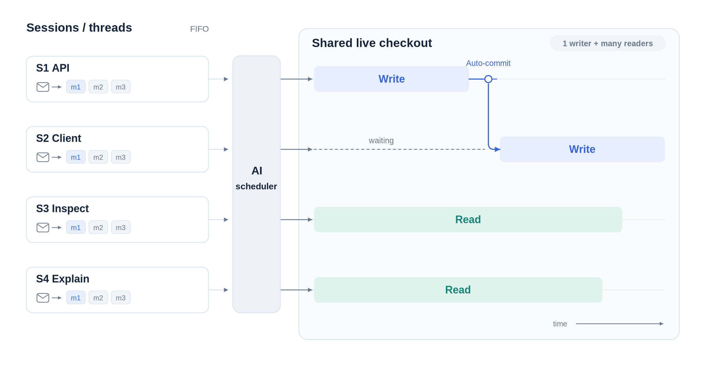

# mub — Mu session scheduler

A terminal UI for [Mu](https://github.com/ylxdzsw/mu) sessions with scheduled
message delivery. Navigate conversations like a terminal multiplexer, but queue
input at any time—even while a session is working.

**Every message goes through the scheduler.** Messages remain FIFO within each
session; the scheduler chooses between sessions. Sessions are conversations, not
tasks with a completion lifecycle.



## Run

Requires Linux with pidfds, Python 3.12+, Git, and configured `mu` on PATH.
Installation includes the embedded Rust terminal engine
`par-term-emu-core-rust` (and its Pillow dependency); no shell, GUI toolkit,
terminal server, or system terminal library is needed.

```sh
uv tool install .
mub -C /path/to/worktree
# From the checkout (requires uv; manages dependencies automatically):
./mub -C /path/to/worktree
# Refresh an existing tool installation after updating the checkout:
uv tool install --force .
```

All directories in a Git worktree resolve to the same board at its root. Only
one mub owner may run in that worktree. Mu invocations run at the worktree root.
Existing branches (including an unborn branch) and detached HEADs are left
unchanged. When starting a board outside a Git repository, mub initializes the
selected directory on `master`; read-only commands such as `status` never
initialize Git. mub does not switch branches or choose a remote's default branch.
Do not run another editing agent against the same checkout outside mub.

## UI

The sidebar lists sessions. The read-only conversation pane displays Mu's native
PTY output: Markdown, tool calls, colors, progress updates, and terminal wrapping.
Saved history is rendered by `mu transcript` on a sized PTY, not reinterpreted
as Markdown. mub adds only the live model/context/cwd header and literal `mu>`
prompt; retry does not duplicate the user prompt. History preparation runs
behind the durable launch gate, so it cannot overlap the new turn's journal.
Independent readers drain every worker PTY, including hidden/headless sessions.
Scheduler JSON stays on a separate non-terminal path: only stdout is parsed as
the decision. Stderr diagnostics, including compaction reports, remain visible
in the scheduler pane and live CLI logs; the latest scheduler stderr is also
available in CLI logs after exit while the owner remains open. CLI logs and trap
evidence use complete captured output rather than a bounded screen snapshot.
The composer is always active, sends to the selected session, and grows with its
draft. There is no pane focus: typing edits the prompt, Tab completes an open
command panel or switches sessions otherwise,
and output navigation leaves the prompt cursor alone. Dialogs and pickers
temporarily take keyboard input.
Mailbox entries are labeled
pending, in-flight, or interrupted; they are not mistaken for delivered history.
Drafts, prompt cursors, and output positions are kept separately for each session
while the UI is open. Scrolling up pauses live following; typing and new output
do not jump back to the bottom. Scroll to the bottom or use Ctrl-End to follow
live output again.

An active invocation keeps its launch-time terminal dimensions. After narrowing
the pane, use `Shift-←` / `Shift-→` to pan horizontally. Idle history
replays at the new size; failed/interrupted screens stay available so transient
errors are not lost. Unused cells are not rewrapped by curses. Colors are mapped
to the outer terminal's available palette (RGB colors to the nearest ANSI color).
The display retains 10,000 scrollback rows; Mu journals remain the durable history.
Headless workers use an 80-column, 24-row terminal.

Terminal bells are ignored. OSC 8 hyperlinks remain in the terminal model,
are underlined, and their targets are available with `/links`; nothing opens
automatically. Worker title changes never rename the host terminal. Clipboard
requests, terminal replies, graphics and external notifications are not forwarded.
The engine interprets alternate screens and cursor controls, but mub does not
forward keyboard/mouse input or claim to host arbitrary interactive applications.

Type your first message to automatically create a session, or use `/new [name]`
to create one explicitly. Use `Tab` / `Shift-Tab` to switch sessions and
`/scheduler` to inspect the scheduler's decisions and output.
The conversation pane shows the session's model even before its first message.
Use `/model session` to choose a model and reasoning effort for that session only,
whether it is new or already has history.
Scheduler status appears once in the top bar. Errors, holds, and blocking reasons
appear only when relevant; model defaults and active models are available through
`/model`, and the full keyboard reference through `/help`.

Session lists show only the ID, one status icon, and the title:
`✎` writing, `≋` reading, `○` idle after writing, `●` idle after reading,
`·` new/idle, `×` failed or trapped, `■` held/interrupted/stopping,
and `…` blocked. Idle icons reflect the last run's mode,
not whether its output has been viewed. Queue details remain in the conversation pane.

| Shortcut | Action |
| --- | --- |
| `Tab` / `Shift-Tab` | Next / previous session, wrapping around; skips scheduler output. Tab fills the selected command when the command panel is open |
| `↑` / `↓` / `←` / `→` | Move the prompt cursor (or select/fill a visible slash command) |
| `Enter` | Queue a message |
| `Shift-Enter`, `Alt-Enter`, or `Ctrl-J` | Insert a newline |
| `PgUp` / `PgDn` | Scroll output by a page with two lines of overlap |
| `Shift-↑` / `Shift-↓` | Scroll output one line |
| `Ctrl-Home` / `Ctrl-End` | Oldest retained output / follow live output |
| `Shift-←` / `Shift-→` | Pan a wider terminal left / right |
| Mouse wheel over output | Scroll output without moving the prompt cursor |
| Click a sidebar session | Select it, keeping input in the composer |
| `Ctrl-N` | Create and select a new session, preserving the previous session's draft |
| `Ctrl-C` | Clear the draft only, even if already empty; use `/interrupt` to stop work |
| `Ctrl-D` (EOF) | Close the selected session (warn if not idle); quit if no sessions are open |
| `Q` / `Esc` in dialogs | Close information screens or cancel a picker |
| `Home` / `End` in composer | Start / end of line |
| `Ctrl-←` / `Ctrl-→` in composer | Jump between words |
| `Ctrl-Backspace` in composer | Delete previous word |

Modified keys depend on terminal support. Mouse reporting does not request motion
events; use your terminal's native-selection bypass (often Shift-drag) to select
and copy text.

Local commands:

- `/new [name]`: create and select a session.
- `/rename <name>`: name the selected session and protect its name from automatic changes.
- `/rename --auto`: let the scheduler name and rename the selected session again.
- `/close`: detach an idle session; confirm discarding any queued messages.
- `/model`: show the selected scheduler/worker defaults and active invocation models.
- `/model scheduler|worker|both`: select models and reasoning effort.
- `/model session`: select the current session's model and effort, or remove its override.
- `/links`: show hyperlink targets from the selected terminal without opening them.
- `/interrupt`: interrupt and hold the selected session.
- `/resume`: release a session hold and explicitly authorize continuation of its
  interrupted turn, if any.
- `/schedule`: recheck the workspace and scheduling. After a scheduler error,
  explicitly start a fresh scheduler session instead of retrying its old turn.
- `/scheduler`: select the scheduler's decisions and output without triggering a
  scheduling pass. Use `Tab` / `Shift-Tab` to return to worker sessions.
- `/help`, `/quit`.

Typing `/` in the composer opens a bounded command list, filtered as you type.
Use `↑` / `↓` to select, `Tab` or `→` at the end of the draft to fill the command before
adding arguments, `Enter` to run it, or `Esc` to hide the list. At most five commands are shown;
the list scrolls with the selection. Tab switches sessions only when the command
list is closed; Shift-Tab always switches to the previous session.

Use `//` to send a literal leading slash. Viewing output never sends keystrokes
to a worker. Dialogs keep process supervision running.

A workspace-owner marker (`◆`) in the conversation header can remain on an idle or held session. That
session still owns uncommitted changes and prevents another writer from starting.

## Scheduling

A bounded, persistent Mu scheduler wakes on message submissions and worker exits. It can
run alongside workers, but only one scheduler invocation runs at a time. Events
arriving during a scheduler turn are retained for another pass. Waiting does not
poll the model. A fixed 50 ms batching window combines nearby events without
extending the delay on every arrival or skipping scheduling decisions.

The scheduler sees pending messages, active workers, Git cleanliness, workspace
ownership, latest worker responses, exit reasons, and complete trap evidence.
It may dispatch several readers and at most one writer, or explain why nothing
should run. It returns a small JSON decision as its final answer; runtime code
validates it against current state before acting.

### Scheduler context and usage

Scheduler snapshots exclude UI/model-selection and process bookkeeping. Worker
responses come from canonical Mu journal text, not PTY progress notices or screen
redraws. Snapshots include each session's two latest materialized requests and
final responses before any active invocation. Requests are excerpted at 2,000
characters and responses at 3,000, with explicit omission markers and a count of
older turns. Pending/inflight mailbox messages and trap evidence remain complete.
Failure diagnostics are kept separately from assistant responses.

Within one scheduler session, unchanged conversational evidence is referenced
rather than resent. Scheduling policy is sent once; each pass still receives the
current gates, holds, ownership, active workers, and FIFO mailboxes. The latest
snapshot overrides older state, and previous decisions are not policy.

Only clean scheduler sessions rotate: after 12 passes, at 32,000 context tokens
(or half the model's context window, whichever is smaller), after compaction,
or when scheduling policy changes. These are between-pass thresholds, not hard
limits on a large message or tool result. A fresh session receives policy and all
current context excerpts again. Older Mu journals are never changed or deleted;
their IDs remain in `scheduler.previous_sessions`. Failed or interrupted turns
still require explicit `/schedule` recovery, never automatic retry.

History references point to a fixed journal byte prefix, so inspection cannot
pull later worker output into an earlier decision. Use the read-only command:

```sh
mub context S1                           # exact requests and final responses
mub context S1 --requests                # inspect scope and restrictions only
mub context S1 --before 12345 --turn t3   # one turn from a snapshot's prefix
```

The scheduler must retrieve missing context before interpreting contextual
approvals or dependencies, and inspect omitted user requests before authorizing
writes or relaxing traps. Excerpts never imply that earlier restrictions expired.
These checks remain model instructions, not a sandbox or a new approval system.

`mub status` exposes `scheduler.last_usage`, the last 24 passes in `recent_usage`,
and `usage_totals` accumulated from this version onward. They report provider
requests, reported input/cached-input/output/reasoning tokens, compactions, and
per-pass elapsed time, prompt characters, and Mu's context estimate/report.
Reasoning tokens are included in output tokens; cached input is included in total
input. Missing usage is unreported, not zero cost. Journals retain the detailed
provider records. `/model` also shows the most recent scheduler pass's usage.

Mu's normal system instructions, skills, and automatic compaction remain enabled;
its current CLI has no scheduler-specific profile override.

### Session names and dependencies

Sessions created without a name start as `Session N`. During ordinary scheduling
passes, the scheduler gives them short topic-based names and updates those names
when the conversation's main focus changes. Names do not include execution status;
session IDs remain stable. Explicitly supplied names are user-owned and never
overwritten by the scheduler, including when a rename happens during a scheduler
pass. `/rename --auto` keeps the current title until a later scheduling pass finds
a useful replacement; renaming alone does not wake the scheduler or affect queued
work or holds. Existing sessions saved before name ownership was introduced keep
their names as user-owned; use `/rename --auto` to opt them in.

The scheduler reasons about prerequisites from messages and outcomes; there is
no dependency graph, numeric priority system, task decomposition, or PM review.
A clean exit means the turn returned—not that mub verified its implementation.

### Readers and the writer

- Multiple readonly workers may run alongside one readwrite worker.
- A session can have only one invocation at a time.
- Readers observe the **live checkout**, not an isolated snapshot. The scheduler
  can defer reads that need a stable baseline.
- A new writer requires a clean checkout, or must be the session that already
  owns its dirty changes.
- An idle, trapped, failed, or held session retains ownership while its changes
  remain uncommitted. Independent readers may still run.
- Existing changes without a known owner block writer dispatch. Resolve them
  manually, then use `/schedule` to recheck.

Git checks include staged, unstaged, and non-ignored untracked files. mub never
automatically stashes, resets, switches branches, rolls back, pushes, or accepts
abandoned changes as another worker's baseline.

### Traps and handoffs

Readonly workers use `--trap reversible`. These are Mu's **model-declared risk
traps, not a sandbox**. A trapped reader may be promoted to writer only when the
writer slot and workspace ownership permit it.

The scheduler resolves ordinary task-related traps automatically, without
requiring `/resume`. Its initial readonly classification is provisional, not a
user prohibition on writes. It interprets conversational change requests in
context, but blocks writes when the user clearly requested only discussion or
inspection, the worker departs from the task, or broader permission is needed.
The blocking reason explains the conflict.

A trap is not a failure. A session waiting for the writer slot or workspace stays
trapped and can be retried automatically when available. Scheduler failure labels
on trapped sessions are treated as blocking explanations, not as changes to the
invocation's outcome. Explicit continuation permission is still required for
genuine failures and interrupted turns; user holds always prohibit execution.

Trap relaxation applies to the **rest of that turn**, not one command. Ordinary writes
start with `--trap destructive`; the scheduler can choose `off` when that broader
permission is justified. A subsequent normal turn gets a fresh access/trap
policy. Single-command approval is not implemented.

Before a dirty handoff, the scheduler prefers the owner's next FIFO message when
it directly continues the uncommitted work and both naturally fit in one coherent
commit. Relatedness is inferred from messages and worker outcomes, not code review.
This soft preference can outweigh global submission order, but not explicit user
priorities or prerequisites. It is reassessed after each turn: the scheduler does
not skip messages, drain unrelated work, indefinitely delay other writers, or wait
for a possible future follow-up. Holds, recovery gates, and writer ownership still
apply, and independent readers may still run. This avoids commit boundaries solely
for session switching without requiring the worker to combine commits.

For a dirty handoff, the scheduler may ask the owning session to commit only its
completed, task-owned changes or explain why it cannot. This is a visibly
scheduler-authored request, which may precede queued user messages. It is not an
implementation follow-up or permission to commit incomplete/unrelated work.
An unsuccessful handoff does not cause repeated commit requests without new user
input.

The scheduler does not investigate implementation quality, repair failures,
troubleshoot provider issues, or work around Mu bugs. Failures are exposed and
may block dependent messages. They are not automatically retried.

### Interruption and shutdown

Interrupting a session records a user hold before signaling its processes. The
hold blocks all automatic work, including queued messages, retries, and commit
requests. Selecting a session, scrolling, or changing models does not release it.

A new message releases the user hold for scheduling, but **does not authorize
retrying an interrupted turn**. `mu retry` continues the old turn and cannot
accept changed instructions. Use `/resume` explicitly after inspecting it; new
messages remain queued behind the interrupted work.

Quitting with active workers or a scheduler asks for confirmation, defaulting to
Cancel. Confirmation stops every owned invocation and records interruptions
before exiting. Workers are not left detached. Reopening does not silently
restart user-interrupted sessions.

There are no mub execution deadlines, inactivity watchdogs, or retry cooldowns;
Mu owns execution timeouts. Explicit stopping uses SIGINT, followed by SIGKILL
for remaining owned processes after a short shutdown grace period. A second
interrupt forces termination immediately.

## CLI and headless use

An open TUI or headless owner accepts mutations over a private local socket.
Submissions do not implicitly start a daemon.

```sh
mub new --name API 'Implement the API endpoint'
mub new --name Review --model provider/model:high 'Review the API'
mub model S1 provider/model:high # change only S1, starting with its next invocation
mub model S1 default             # remove S1's override
mub send S1 'Use cursor-based pagination'
mub rename S1 'API pagination'
mub rename S1 --auto            # allow the name to evolve on later scheduler passes
mub new --name Investigation 'Read the existing authentication flow'
mub status
mub logs S1
mub interrupt S1
mub resume S1
mub remove S2                   # add --discard to discard pending messages
mub models
mub models --scheduler provider/model:low --worker provider/model:high
mub models --worker default
mub schedule
mub quit --yes                  # explicitly stop running agents

mub run --headless
mub run --headless --until-idle
```

`send` also reads text from stdin. `status` and `logs` work without an open owner.
`--until-idle` exits when no invocation or actionable scheduling event remains;
held, blocked, or failed sessions may still have pending messages.

`--scheduler-model`, `--worker-model`, and `--model` override models for the current
launch. UI/CLI model selections persist and apply only to later invocations,
including existing sessions. “Mu/session default” removes an override.
Per-session model choices persist and take precedence over the worker default,
including launch overrides. Removing a session override inherits the worker
selection, or Mu's remembered session/configured model when no worker override
is set. Active invocations retain their model; changing a model does not release
a hold or trigger work.

## Persistence

**`.mu/mub.json` is the only mub-owned durable state file.** It contains session
references, mailboxes, in-flight invocation records, holds and outcomes, workspace
ownership, pending scheduling events, and model choices. It is atomically replaced
and locally Git-ignored via Git's `info/exclude` without editing tracked ignore
configuration.

Mu journals own delivered conversations. mub does not copy transcripts or archive
terminal logs. Live output and full trap evidence are transient; history replays
from Mu. Only bounded recent outcome excerpts are kept for scheduling. A stable
owner lock and a live control socket are runtime artifacts in `.mu/`.

A journal offset records each delivery boundary, allowing mub to distinguish a
completed message from an invocation that never accepted its input. A crash
leaves uncertain in-flight work held for explicit inspection and continuation;
messages are not blindly resubmitted. Live processes from a previous
owner prevent a replacement owner from starting. Removing a session only detaches
it from mub; it never deletes the Mu journal or undoes edits.

Old task-board snapshots are **not automatically converted**. Opening one fails
without overwriting it. Archive the old `.mu/mub.json` explicitly before starting
a new board; Mu journals remain untouched.

## Checks

```sh
uv run python -m compileall -q muboard tests
uv run python tests/smoke.py
```

Smoke checks use temporary Git worktrees and fake Mu processes, with no provider
calls. They exercise mailbox delivery, reader/writer concurrency, clean handoffs,
traps, failures, interruption holds, stale decisions, persistence, and a real
PTY-driven UI workflow. Terminal checks cover cursor/erase updates, color,
split UTF-8, wide cells, alternate screens, hyperlinks, ignored bells,
and draining large output while preserving complete trap evidence.
